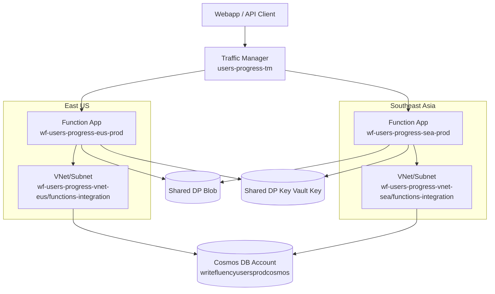
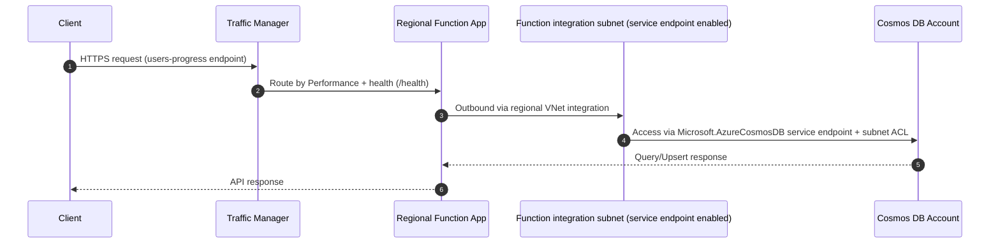
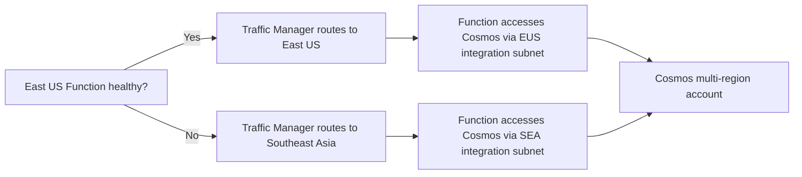
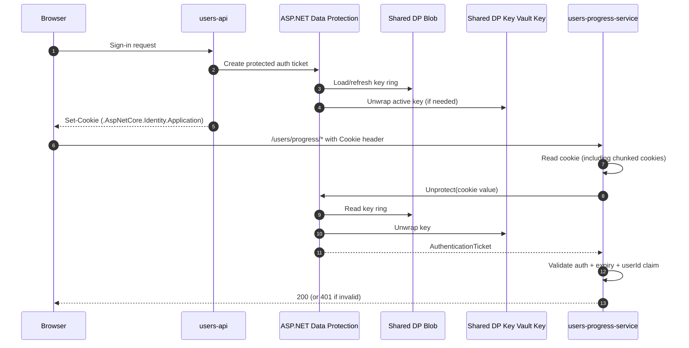

# Users Progress Infra Architecture

This document explains how the `users-progress` infrastructure works in Azure, including multi-region routing, Cosmos DB network isolation with service endpoints, and shared cookie/data-protection dependencies.

## Scope

- Workload: `users-progress-service` (Azure Functions, .NET isolated)
- Regions: `East US` and `Southeast Asia`
- Global entry point: Azure Traffic Manager (`Performance` routing)
- Data plane: Azure Cosmos DB (SQL API, multi-region)
- Network model: Cosmos restricted to selected VNet subnets through service endpoints

## High-level Components

- `Function App (East US)` and `Function App (Southeast Asia)`
- `Flex Consumption plan` per region
- `VNet` per region with:
  - Function integration subnet (`Microsoft.AzureCosmosDB` service endpoint)
  - Reserved `cosmos-private-endpoint` subnet kept for migration compatibility (no new PE dependencies)
- Cosmos network ACL (`Selected networks`) allowing only the Function integration subnets
- `Traffic Manager profile` with health probe on `/health`
- `Cosmos DB account` with multi-region + automatic failover + multiple write locations
- Shared Data Protection resources:
  - Blob Storage (key ring persistence)
  - Key Vault key (key wrapping)

## Component Diagram

## Request/Data Flow (Normal Path)

## Failover Behavior

## Security and Identity Model

- Cosmos keeps `publicNetworkAccess: Enabled`, but access is restricted by network ACL:
  - Only selected integration subnets are allowed (`virtualNetworkRules` + `isVirtualNetworkFilterEnabled`).
  - Optional explicit `ipRules` can be maintained for operator access.
- Functions authenticate to Cosmos using `DefaultAzureCredential` + managed identity.
- Cosmos data-plane access is granted using SQL role assignments for each Function identity.
- Shared cookie decryption uses Data Protection:
  - Keys persisted in Blob.
  - Keys wrapped/unwrapped with Key Vault key.
  - Both regional functions receive Blob/KV RBAC assignments.

## Shared Cookie + Data Protection (Deep Dive)

This section explains exactly how the `users-api` and `users-progress-service` trust the same login cookie.

### Goal

When a user logs in through `users-api`, the browser receives one auth cookie.  
Later, when the browser calls `users-progress-service`, that second API can decrypt and validate the same cookie without calling `users-api`.

### Components and Their Jobs

- `users-api`:
  - Signs in the user and issues the auth cookie (`SharedAuthCookie` settings).
  - Uses ASP.NET Data Protection to encrypt/sign the cookie ticket.
- `users-progress-service`:
  - Reads the cookie from incoming HTTP headers.
  - Uses the same Data Protection configuration to decrypt/validate the ticket.
  - Extracts `NameIdentifier`/`sub` claim and authorizes the request.
- `Shared Data Protection Blob`:
  - Stores the key ring XML (the key set used by Data Protection).
- `Shared Key Vault key`:
  - Wraps/unwraps Data Protection keys at rest.
- Managed identities (users-api + both Function Apps):
  - Access Blob and Key Vault without connection secrets.
- RBAC role assignments:
  - Grant those managed identities permission to read/write key ring and use KV crypto operations.

### End-to-End Sequence (Step by Step)

### What Must Match Between APIs

For cross-API cookie sharing to work, these values must be aligned:

- `SharedAuthCookie__Scheme` (example: `Identity.Application`)
- `SharedAuthCookie__CookieName` (example: `.AspNetCore.Identity.Application`)
- `SharedDataProtection__ApplicationName`
- `SharedDataProtection__BlobUri`
- `SharedDataProtection__KeyIdentifier`

If any of these differ, the progress API may fail to decrypt and will treat the request as unauthenticated.

### Why Cookie Decryption Sometimes Fails

Common causes:

- Wrong `ApplicationName` between APIs.
- Wrong cookie scheme/name in progress API.
- Missing RBAC on shared Blob or Key Vault for Function managed identity.
- Key Vault/Blob temporarily unavailable.
- Old cookie signed with a key that is no longer available.
- Cookie chunking mismatch (handled in code by reconstructing `CookieNameC1..Cn` chunks).

### Local vs Production Behavior

- Local and production use the same mechanism (Data Protection + Blob + Key Vault).
- Credentials differ:
  - Local: usually `DefaultAzureCredential` from your developer identity.
  - Production: managed identity from each app/function.
- Because the mechanism is the same, local is a realistic validation of cookie compatibility.

### Quick Troubleshooting Checklist

1. Confirm both APIs have identical `SharedAuthCookie` values.
2. Confirm both APIs point to the same `SharedDataProtection` Blob URI and Key Identifier.
3. In Key Vault IAM, verify app identities have crypto permissions (RBAC role).
4. In Storage IAM, verify app identities have Blob data access to the key-ring container.
5. If auth still fails, inspect progress API logs for `Unable to unprotect shared authentication cookie`.

## Key Runtime Settings (Function App)

The Function Apps receive app settings for:

- `Cosmos__Endpoint`
- `Cosmos__DatabaseName`
- `Cosmos__ProgressContainer`
- `Cosmos__AttemptsContainer`
- `Cosmos__Namespace`
- `SharedAuthCookie__Scheme`
- `SharedAuthCookie__CookieName`
- `SharedDataProtection__ApplicationName`
- `SharedDataProtection__BlobUri`
- `SharedDataProtection__KeyIdentifier`
- `Cors__AllowedOrigins__*`

Container names are namespaced at runtime (`_prod` or `_local`) by `Cosmos__Namespace`.

## Communication Summary

- Client to Function:
  - Public HTTPS through Traffic Manager.
- Function to Cosmos:
  - VNet integration subnet with `Microsoft.AzureCosmosDB` service endpoint.
  - Cosmos accepts only selected subnets (network ACL).
- Function to Data Protection Blob/Key Vault:
  - Azure RBAC with managed identity.
- Region selection:
  - Traffic Manager performance routing + endpoint health.

## Common Failure Modes

- `403 Forbidden` from Cosmos after network changes:
  - Usually missing subnet ACL in Cosmos, missing service endpoint on subnet, or propagation delay.
  - Validate both subnets are in `virtualNetworkRules` and wait for network rule propagation.
- `Insufficient privileges` in deployment pipeline:
  - Deploy principal missing RBAC (especially for role assignments).
- Cookie auth mismatch:
  - `SharedDataProtection` settings differ from users API settings.

## IaC Files

- Main infra template: `infra/users-progress/main.bicep`
- Cosmos baseline infra: `infra/cosmos/main.bicep`
